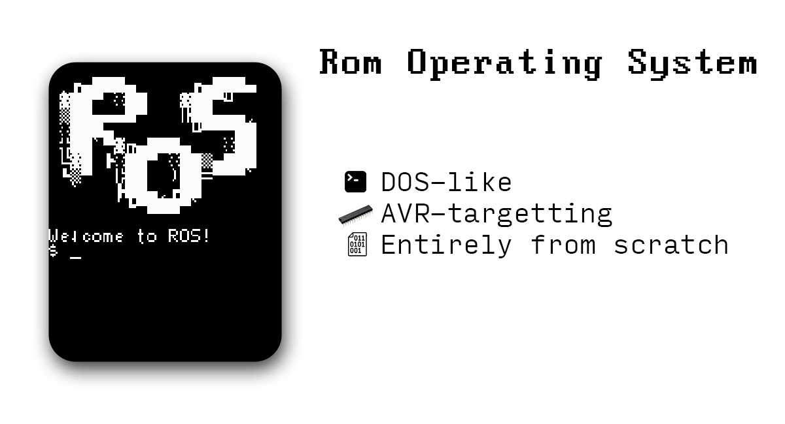

# ROS

### Introduction

**ROS** (_Rom Operating System_) is a small, DOS-like, AVR-targetting operating system, written specially for my own computing machine _NPAD 5_. 

It operates in text mode, without any _UI_, but applications can still draw _TUI_ using pseudo graphics.

The main idea of the project is to minimize usage of external libraries to reach the highest level of perfomance and efficiency. That's why all modules are beging made completely from scratch, including:

- Hardware drivers
- Custom 6x8 px font
- Custom filesystem

System works with filesystem located directly in _EEPROM chips_.

### Hardware

- **Screen** : ST7735 based 128x160 px TFT display
- **Keyboard** : Custom keyboard which uses _74hc165 shift registers_
- **CPU** : ATmega328P
- ...

### Build

- #### Step 1 - clone the repository

First of all you need to clone repository. The following command to do it:

    git clone https://github.com/Nikita-bunikido/ROS.git

- #### Step2 - compile & link modules

Using Makefile:

    cd ROS
    make

### TODO

- Command shell
- Interacting with RAM
- [CHIP-8](https://en.wikipedia.org/wiki/CHIP-8) programs loading & executing
- Custom filesystem/ROM support
- Documented API
- Builtin applications:
  - Physical memory editor
  - Hex editor
  - Text editor
  - CHIP8 assembler
  - Basic interpreter
- Custom file formats support
- ...

### CHANGELOG

- Font 6x8px (ASCII & pseudo graphics)
- SPI driver
- ST7735 driver
- Keyboard driver
- Output stack
- Basic I/O functions
- Full QWERTY support
- Replaced *"reserved"* attribute with *"underline"*
- Text cursor
- Input buffer
- System modes
  - Input mode
  - Busy mode
  - Idle mode
- ROS logo in boot process
- Log system
- Red screen of death
- Graphic timer
- Blinking cursor
- Cursor visibility control
- Flashing threads